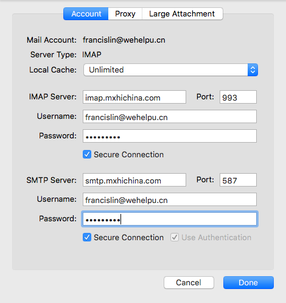

# 微助后台开发组新手任务

## 开通帐号
1. 给自己创建英文名
    * 格式为`英文名+姓`,例如: francislin, jackzhang, allenpeng
2. 申请`wehelpu.cn`邮箱，并配置好邮箱客户端
    * 推荐使用foxmail。配置参考下图
    
3. 访问[http://dev.wehelpu.cn](http://dev.wehelpu.cn)注册gitlab代码库帐号。
4. 开通微助App账号，下载App。App构建下载地址: [http://test.wehelpu.cn/build](http://test.wehelpu.cn/build) (注：ios平台请先安装根证书weizhu_ca.crt，再下载app)
5. 加入公司相关qq,微信群。

## 搭建开发环境
1. 参考[weizhu_server 构建代码](build_src.md)文档
2. jdk,maven,eclipse配置
3. redis,mysql安装配置
4. 构建代码
5. 相关软件公司内下载[http://test.wehelpu.cn/build/software](http://test.wehelpu.cn/build/software)

## 工具准备
1. 使用科学上网工具
    * 可使用google搜索
    * 下载官网资源(google developer相关, android sdk, xcode 等等)
    * 获得最新的技术资讯(twitter)
2. 理解并掌握常用git操作
    * 参考文章: [常用 Git 命令清单](http://www.ruanyifeng.com/blog/2015/12/git-cheat-sheet.html)
    * Workspace; Index/Stage; Repository; Remote 理解
    * Eclipse上对应的图形化操作
    * rebase提交理解
3. 学习使用markdown编写文档
    * [gitlab](https://gitlab.com/help/markdown/markdown.md): 使用其中的Standard Markdown

## 知识点学习，编写相应的demo代码
1. 使用jedis访问redis。
2. 使用HikariCP访问mysql。(使用Mysql multi query 查询数据)
3. protobuf 学习。编写简单的结构体，填充数据编码为二进制/json后再解码。
4. guava 学习.参考[Google Guava官方教程（中文版）](http://ifeve.com/google-guava/)
5. guice 学习.参考[Google Guice 系列教程 － 基础实践](http://www.tuicool.com/articles/yqueqa)

## 相关培训
1. 后台整体架构介绍
2. 业务服务开发流程
3. 团队合作规范

## 开发规范
1. 代码规范
2. git提交规范
3. 代码review

## 进阶
1. linux常用操作
2. 代码发布
