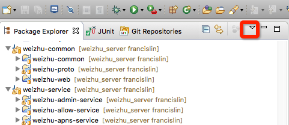

# weizhu_server 构建代码

## windows环境准备

1. 安装JDK
    * 请安装jdk1.8.0 以上版本
    * 配置环境变量 `JAVA_HOME`
    * 将 `JAVA_HOME\bin` 加入到PATH下
2. 安装MAVEN
    * 请安装最新版本的MAVEN
    * 配置环境变量 MAVEN_HOME
    * 将 `MAVEN_HOME\bin` 加入到PATH下
3. 安装cygwin环境。用来执行linux脚本和命令
    * 登录官网下载。[官网地址](https://www.cygwin.com/)
    * 安装好 `ssh`, `scp`, `rsync`, `git` 等命令
4. 使用virtualbox安装CentOS虚拟机
    * 登录官网下载virtualbox最新版. [官网地址](https://www.virtualbox.org/)
    * 安装virtualbox
        - 注意安装路径和虚拟机放置路径
        - 安装对应版本的 Extension Pack
    * 下载CentOS-6.x-x86_64-minimal版本的iso文件
        - [官网下载镜像地址列表](http://isoredirect.centos.org/centos/6/isos/x86_64/)
        - 推荐下载完成后校验一下文件的md5，验证下载文件是否正确
    * 打开virtualbox新建虚拟机
        - Name 填写 `weizhu-build`
        - Type 选择 `Linux`
        - Version 选择 `Red Hat (64-bit)`
        - Memory size 设为 `1024MB`
        - Hard Disk 新建并选择 `Dynamically allocated`, 设为 `10GB`
        - CPU 建议设为双核
        - 光盘 使用刚才下载的CentOS iso文件
        - 网络 使用 `NAT` 模式，在高级选项中配置好端口转发
        - ssh端口转发：名称`ssh`,协议`TCP`,主机IP 不填,主机端口`22`,子系统IP 不填,子系统`22`
        - redis端口转发：名称`redis`,协议`TCP`,主机IP 不填,主机端口`6379`,子系统IP 不填,子系统`6379`
        - mysql端口转发：名称`mysql`,协议`TCP`,主机IP 不填,主机端口`3306`,子系统IP 不填,子系统`3306`
    * 启动 `weizhu-build` 虚拟机，并安装
        - 使用语言为英文，时区为上海
        - 选择删除所有数据，全新安装
        - 设置好root用户密码
        - 其他选项使用默认值即可
    * 使用root账号登录虚拟机，开始配置
        - 打开网络。修改`/etc/sysconfig/network-scripts/ifcfg-eth0`文件，将`ONBOOT=no`修改为`ONBOOT=yes`，重启网络`service network restart`
        - 关闭防火墙。执行命令`chkconfig iptables off`, `service iptables stop`
        - 关闭SELINUX。修改`/etc/selinux/config`,将`SELINUX=enforcing`改为`SELINUX=disabled`
        - 安装更新。执行命令`yum update -y`
        - 重启虚拟机。执行命令`reboot`
    * 打开cygwin终端，执行`ssh root@127.0.0.1`登录虚拟机，验证配置是否成功
        - 如果登录不成功，可能是虚拟机端口转发不成功。请关闭虚拟机和virtualbox, 并重启几次即可
5. 在虚拟机中安装redis
    * 使用redis3.x版本
    * 从[官网下载](http://download.redis.io/releases/)最新的3.x版本
    * 在cygwin终端下使用scp命令将压缩包上传到虚拟机`scp redis-3.x.tar.gz root@127.0.0.1:~/`
    * 在虚拟机中安装 gcc命令 `yum install gcc -y`
    * 在虚拟机中解压缩 `tar -zxvf redis-3.x.tar.gz`
    * 切换当前目录到解压缩后的redis目录中,执行命令编译并安装redis `make install`
    * 执行脚本将redis安装为linux服务 `utils/install_server.sh`. 选项都为默认即可
    * 执行命令`redis-cli INFO` 验证安装是否成功
6. 在虚拟机中安装mysql
    * 使用mysql 5.6版本
    * [官网下载页面](http://dev.mysql.com/downloads/mysql/5.6.html#downloads)
    * 请下载`Linux - Generic (glibc 2.5) (x86, 64-bit), RPM Bundle`，下载完成后建议校验MD5
    * 在cygwin终端下使用scp命令将安装包上传到虚拟机`scp MySQL-5.6.x.rpm-bundle.tar root@127.0.0.1:~/`
    * 在虚拟机中安装 perl命令`yum install perl -y`
    * 在虚拟机中删除旧的mysqllib `yum -y remove mysql-libs-5.1*`
    * 在虚拟机中解压缩 `tar -xvf MySQL-5.6.x.rpm-bundle.tar`
    * 安装mysql相关rpm包
    
        ```
        rpm -ivh MySQL-server-5.6.x.x86_64.rpm 
        rpm -ivh MySQL-client-5.6.x.x86_64.rpm
        rpm -ivh MySQL-devel-5.6.x.x86_64.rpm 
        rpm -ivh MySQL-shared-5.6.x.x86_64.rpm 
        rpm -ivh MySQL-shared-compat-5.6.x.x86_64.rpm
        rpm -ivh MySQL-embedded-5.6.x.x86_64.rpm 
        ```
    * 创建`/etc/my.cnf`文件，配置mysql支持utf8mb4字符集
    
        ```
        [client]
        default-character-set = utf8mb4
        
        [mysql]
        default-character-set = utf8mb4
    
        [mysqld]
        character-set-client-handshake = FALSE
        character-set-server = utf8mb4
        collation-server = utf8mb4_unicode_ci
        init_connect='SET NAMES utf8mb4'
        ```
    * 启动mysql `service mysql start`
    * 执行命令将root密码置为空`mysqladmin -u root -p password ''`. 初始root密码在 `~/.mysql_secret` 文件中
    * 执行命令确认 utf8mb4 更改结果
    
        ```
        mysql -uroot -e "SHOW VARIABLES WHERE Variable_name LIKE 'character\_set\_%' OR Variable_name LIKE 'collation%';"
        ```
    * 执行命令创建db
        
        ```
        mysql -uroot -e "create database weizhu_test;"
        ```
    * 执行命令给root所有ip访问赋权
    
        ```
        mysql -uroot -e "grant all on *.* to root@'%';"
        ```
## mac环境配置

1. 安装JDK
    * 请安装jdk1.8.0 以上版本
    * 修改`~/.bash_profile`文件，创建JAVA_HOME变量, 并将`JAVA_HOME\bin` 加入到PATH下
    
        ```
        # 样例，请根据安装的具体版本调整
        export JAVA_HOME=/Library/Java/JavaVirtualMachines/jdk1.8.0_66.jdk/Contents/Home
        export PATH=$PATH:$JAVA_HOME/bin
        ```
2. 安装MAVEN
    * 请安装最新版本的MAVEN
    * 修改`~/.bash_profile`文件，创建MAVEN_HOME变量, 并将`MAVEN_HOME\bin` 加入到PATH下
    
        ```
        # 样例，请根据安装的具体版本调整
        export MAVEN_HOME=/Users/lindongjlu/Develop/apache-maven-3.3.3
        export PATH=$PATH:$MAVEN_HOME/bin
        ```
3. 安装homebrew
    * [homebrew官网](http://brew.sh/)
    * 参考官网说明安装
4. 安装redis
    * 执行命令安装 `brew install redis`
    * 启动redis `launchctl load /usr/local/opt/redis/homebrew.mxcl.redis.plist`
    * 在终端执行命令验证安装结果 `redis-cli INFO`
    * 如果要关闭redis，执行 `launchctl unload /usr/local/opt/redis/homebrew.mxcl.redis.plist`
5. 安装mysql
    * 执行命令 `brew install mysql`
    * 创建配置文件 `/usr/local/etc/my.cnf`，配置mysql支持utf8mb4字符集
    
        ```
        [client]
        default-character-set = utf8mb4
        
        [mysql]
        default-character-set = utf8mb4
    
        [mysqld]
        character-set-client-handshake = FALSE
        character-set-server = utf8mb4
        collation-server = utf8mb4_unicode_ci
        init_connect='SET NAMES utf8mb4'
        ```
    * 启动mysql `launchctl load /usr/local/opt/mysql/homebrew.mxcl.mysql.plist`
    * 执行命令将root密码置为空`mysqladmin -u root -p password ''`. 初始root密码在 `~/.mysql_secret` 文件中
    * 执行命令确认 utf8mb4 更改结果
    
        ```
        mysql -uroot -e "SHOW VARIABLES WHERE Variable_name LIKE 'character\_set\_%' OR Variable_name LIKE 'collation%';"
        ```
    * 执行命令创建db
        
        ```
        mysql -uroot -e "create database weizhu_test;"
        ```
    * 如果要关闭mysql，执行 `launchctl unload /usr/local/opt/mysql/homebrew.mxcl.mysql.plist`
    
## windows命令行构建代码

1. **确认源代码放置路径不能有空格**
2. 打开cygwin终端
3. 切换当前目录到源代码跟目录。
4. 执行`sh /build.sh`
5. 构建好的代码就在源代码跟目录的build目录下

## mac命令行构建代码

1. 打开终端
2. 切换当前目录到源代码跟目录
3. 执行`sh /build.sh`
4. 构建好的代码就在源代码跟目录的build目录下

## 在 Eclipse 环境中开发代码

1. 在代码根目录下执行命令
    * `mvn install`
    * `mvn eclipse:eclipse -DdownloadSources=true`
2. 打开Eclipse并配置
    * Eclipse -> Preference -> Maven -> Installations -> Add 选择刚才安装的maven，并设为默认 
    * Eclipse -> General -> Workspace 确认全局默认文本编码为 UTF-8
3. 创建四个working sets
    * 
    * 点击IDE左侧栏右上角 向下的箭头 -> Configure Working Sets
    * 创建四个working sets： weizhu-common weizhu-service weizhu-webapp weizhu-server
    * 点击IDE左侧栏右上角 向下的箭头 -> Top Level Elements -> 选择Working Sets
4. 将代码git库添加到eclipse中
    * Eclipse -> Windows -> Show View -> Other -> 在弹出的窗口中选择 Git/Git Repositories
    * 添加代码git库
    * 选中Working Directory 中的common, 点击右键 -> Import projects -> 选择import existing Eclipse projects -> 选择所有工程并添加到 weizhu-common working set中 -> finish
    * 选中Working Directory 中的service, 点击右键 -> Import projects -> 选择import existing Eclipse projects -> 选择所有工程并添加到 weizhu-service working set中 -> finish
    * 选中Working Directory 中的webapp, 点击右键 -> Import projects -> 选择import existing Eclipse projects -> 选择所有工程并添加到 weizhu-webapp working set中 -> finish
    * 选中Working Directory 中的server, 点击右键 -> Import projects -> 选择import existing Eclipse projects -> 选择所有工程并添加到 weizhu-server working set中 -> finish
5. 可以开始写代码了

    