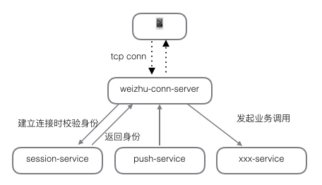
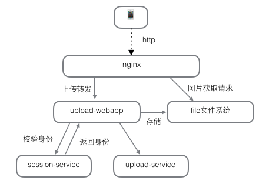
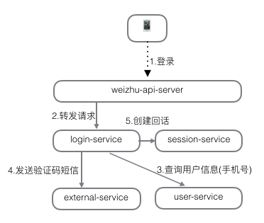

# 微助后台设计简介

---

## 功能简介

#### 客户端功能
1. 即时通讯功能
    * 发起点对点聊天
    * 发起群组聊天
    * 发送文本消息/图片消息/声音消息
    * 消息提醒
2. 通讯录功能
    * 星标联系人
    * 组织结构展示
    * 人员搜索
3. 服务号功能
    * 服务号信息推送/收集
    * 小秘书功能
4. 发现模块功能
    * 轮播图展示
    * 发现模块/课件展示，新课件红点提示
    * 课件学习/打分/点赞/评论功能
    * 课件支持文档(pdf)/音频(mp3)/视频(avi,mp4)/网页链接内容
    * 课件支持离线下载
    * 课件搜索
    * 问答功能
    * 考试功能
5. 社区功能
    * 板块/帖子内容展示
    * 帖子置顶功能
    * 板块热帖列表功能
    * 帖子发表评论
    * 帖子回复提醒
6. 我的相关
    * 我的个人信息
    * 我的设置
    * 发现相关信息

#### 管理后台功能

1. 管理员帐号管理
2. 企业人员管理
3. 服务号管理
4. 发现管理
5. 问答模块管理
6. 考试模块管理
7. 社区管理

---

## 预备技术
1. 语言: java
2. 构建工具: maven
3. 数据库: mysql
4. 分布式缓存: redis
5. RPC (Remote Procedure Call)
6. IoC (Inversion of Control)
7. http/tcp 协议
8. 通用组件: guava,guice,protobuf,jedis,HikariCP
9. 网络组件: netty,jetty
10. 分布式服务设计

---

## 源代码结构

```
weizhu_server
├── common
│   ├── common
│   ├── proto
│   └── web
├── service
│   ├── admin
│   ├── allow
│   ├── community
│   ├── company
│   ├── discover
│   ├── exam
│   ├── external
│   ├── im
│   ├── login
│   ├── official
│   ├── push
│   ├── qa
│   ├── session
│   ├── settings
│   ├── stats
│   ├── system
│   ├── upload
│   ├── user
│   └── webrtc
├── webapp
│   ├── admin
│   ├── mobile
│   └── upload
├── server
│   ├── all
│   ├── api
│   ├── common-logic
│   ├── company-logic
│   ├── company-proxy
│   ├── conn
│   ├── external
│   ├── push
│   └── upload
└── mobile
    ├── android
    └── proto

```

#### 公共组件 weizhu_server/common
* 通用公共代码
* 与业务逻辑无关
* **weizhu-common** 通用工具
    1. DB访问工具-`HikariCP`
    2. Cache访问工具-`jedis`
    3. IoC工具-`guice`
    4. RPC工具-`netty,protobuf`
    5. Service相关工具-`guava`
    6. 其他工具
* **weizhu-proto** 协议定义
    1. service协议文件-`*.proto`
    2. service接口类-`XXXService`
* **weizhu-web** webapp通用工具

#### 业务逻辑服务 weizhu_server/service
* 每块独立的业务功能设定为一个Service
* Service对外提供RPC接口
* Service中包含业务逻辑的具体实现
    - `XXXImpl` 主要业务逻辑实现
    - `XXXModule` 依赖定义
    - `XXXDB` 访问DB逻辑
    - `XXXCache` 访问Cache逻辑 
* 不同Service之间只能根据RPC接口调用，**不能直接访问其他Service的DB/Cache存储**
* 例：SessionService

    

#### 部署进程 weizhu_server/server
* 将多个Service合并打包为一个独立的jar
* 根据配置文件，为Service提供 线程池/DB/Cache/配置 等依赖资源
* 独立部署为一个Java进程
* 绑定IP，Port可以对外提供RPC服务
* 例: weizhu-all-server

    


#### 客户端协议sdk weizhu_server/mobile
* 客户端协议proto生成代码
* Api网络访问代码
* 长连接访问客户端逻辑

---

## 部署架构

#### 单进程结构

```
/etc/init.d/weizhu-common-logic-server

/usr/local/weizhu/weizhu-common-logic-server
|-- bin
|   |-- start.sh
|   `-- weizhu-common-logic-server-20151202Build0003.jar
|-- conf
|   |-- logback.xml
|   `-- server.conf
|-- logs
|   |-- weizhu_service.log
|   |-- weizhu_service.2015-12-01.log.gz
|   |-- weizhu_service_invoke_read.log
|   |-- weizhu_service_invoke_read.2015-12-01.log.gz
|   |-- weizhu_service_invoke_write.log
|   |-- weizhu_service_invoke_write.2015-12-01.log.gz
|   |-- jvm.log
|   `-- other.log
`-- tmp
    `-- server.pid
```

* java进程部署为linux service，开机自启动
* 启动脚本 bin/start.sh
* conf目录下放配置文件
* logs目录放日志文件，每天的日志生成一个独立的文件并压缩
* tmp/server.pid 进程pid文件

#### 整体服务单机部署


* nginx 用来做http分发和静态资源访问(未画出)
* webapp-xxx 负责web访问的接入，rpc调用weizhu-all-server提供的接口
* weizhu-all-server 负责全部业务逻辑处理，包括手机端api接入，长连接接入等
* mysql负责数据的持久化存储
* redis负责数据访问的缓存，提高业务性能

#### 整体服务分布式部署


1. 接入层：访问接入，校验登录身份等
    * nginx: http访问转发，负载均衡
    * webapp-xxx: web访问实际接入，web页面展示
    * weizhu-api-server: 手机客户端http api请求接入
    * weizhu-conn-server: 手机客户端tcp长连接接入(也可走api请求)
2. 逻辑层：处理业务逻辑，并返回结果
    * weizhu-common-logic-server: 微助公共逻辑server
    * weizhu-push-server: 负责推送相关的逻辑
    * weizhu-company-proxy-server: 微助多公司转发server，没有具体逻辑，只负责转发
    * weizhu-company-xxx-server: 微助公司业务逻辑server，可根据公司业务量水平扩展
3. 存储层：
    * mysql负责数据的持久化存储
    * redis负责数据访问的缓存，提高业务性能
    * 每个server都有独立的db和cache

---

## 重要功能模块说明

#### Protobuf


1. `xxx.proto` 定义message Person的描述
2. `XxxProtos.java` 执行命令`protoc`生成java文件
    * `XxxProtos.Person` 
    * `XxxProtos.Person.Builder`
3. 使用`XxxProtos.Person`类可以将数据编解码为二进制数据
4. 优点：定义严谨，向前向后兼容性好。编码后的数据很小，编解码速度快
5. 缺点：二进制数据可读性差

#### RPC功能


1. RpcServer 负责Rpc通讯Server端
2. RpcClient 负责Rpc通讯client端，只负责一个Server进行点对点通讯
3. AutoSwitchRpcClient 负责维护多个RpcClient
    * 支持自动切换，自动剔除挂掉的服务端。
    * 支持负载均衡
4. 使用tcp长连接通讯，支持同一个连接同时发起多个请求
5. 支持异步调用
6. 使用`netty`网络框架实现

#### Service功能


1. UserService接口定义服务的具体接口
2. ServiceStub利用java反射功能，将java调用转为RpcClient调用
3. RpcClient将请求利用网络发送到RpcServer端
4. ServiceStub利用java反射功能，将请求分发到UserService实现类
5. UserService实现类负责具体业务逻辑的实现，并将结果原路返回

#### Api请求接入


1. 手机端发起api请求(http + protobuf协议)
2. 根据传入的session key,校验用户身份
3. 返回身份信息(公司id，员工id，会话id)
4. 发起具体的业务调用逻辑

#### 客户端长连接接入



1. 手机端建立tcp长连接
2. 建立连接时，调用SessionService 校验身份(同api接入)
    * 校验成功后，定时发送ping保持长连接
    * 校验失败直接关闭连接
3. PushService 可以向用户推送数据
4. 可以利用长连接发送api请求(链路复用)

#### web接入


1. nginx负责转发和负载均衡
2. webapp负责具体的页面和接口逻辑
3. session-service校验身份
4. 页面接口逻辑会调用业务service

#### 文件上传



1. nginx负责将文件上传转发到webapp
2. upload-webapp 校验身份后，接收具体文件
3. 文件接收成功后存储到linux文件系统中，并通知upload-service保存文件上传的相关信息
4. 获取图片文件的请求，将由nginx直接访问文件系统获取


#### 登录功能




#### 网络电话功能(VoIP)


1. 使用`WebRTC`技术, google开源
2. 通话主叫端发送offer请求
3. offer请求经过weizhu-server通道，发送到通话被叫端
4. 通话被叫端发送answer请求到主叫端
5. 主叫端接收answer请求后，完成链路建立
6. 链路建立后，webrtc会根据turnserver确定网络环境
    * 同一内网中可直接连接
    * 不同网络间可根据网络情况进行路由器打洞直连，或者经过turnserver通讯
    * 网络发生变化时，可以自动切换
7. 发起点对点通话


