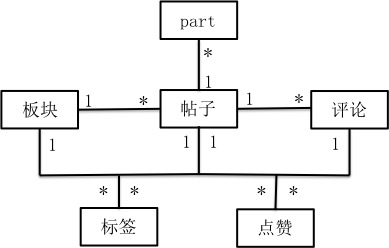

# 社区设计文档

## 手机端设计

1. 板块
    * 帖子的板块，可以有多级板块，当板块下有子板块时不能发帖。
2. 帖子
    * 帖子包含标题和内容，内容可以有文字和图片，目前版本只能发单图，下一版本引入多图和视频。
    * 帖子分为最新和最热，最新帖按时间倒序排列，最热贴排列规则为：（查看次数＋评论数＋点赞数）＋ 时间衰减系数，目前查看次数未考虑。
    * 帖子种类又分为普通贴、置顶贴和推荐贴。置顶贴，显示在板块顶部，最多十条，后期还会引入自动置顶贴。推荐贴显示在首页，最多十条。
3. 评论
    * 用户可以对帖子直接进行评论，也可以评论帖子的评论。评论后，后台会push消息给被评论的帖子或评论的创建人。
4. 点赞
    * 用户可以对帖子和评论进行点赞。
5. 标签
    * 板块下含有标签，发帖时可以选择标签，则后台根据标签获取相应的人员进行通知。
    
## 管理后台设计

1. 板块
    * 管理员可以在后台创建板块及其子板块。也可以对板块进行查看、排序、修改和删除。
2. 帖子
    * 管理员可以在后台创建帖子，并可以批量导入问题。也可以查看、导出、搜索、迁移、推荐、置顶、修改和删除问题
3. 评论
    * 管理员可以在后台创建、查看、导出、和删除评论。
4. 点赞
    * 管理员可以在后台查看和导出点赞的人员列表。
5. 修改社区名称
6. 访问模型
    可以给板块添加访问模型，使其只对特定用户可见
    
## 设计图

