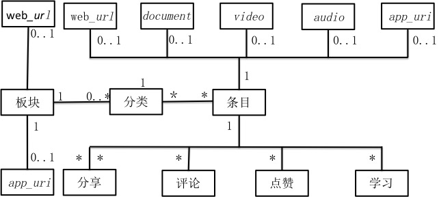

# 发现设计文档

## 手机端设计

1. 模块
    * 只有一级模块，模块下可以有分类，也可以是web_url或app_uri。
2. 分类
    * 只有一级分类，分类下直接是条目。
3. 条目
    * 条目可以是web_url、document、video、audio、或app_uri。
4. 点赞
    * 用户可以对条目进行点赞。
5. 学习
    * 点进条目查看即为学习，可以查看学习的时常和次数等信息。
6. 分享
    * 分享分为内部分享和外部分享，内部分享指分享给微助的内部好友，外部分享指分享到微信等其他平台。
7. 评论
    * 用户可以对条目进行评论。

## 管理后台设计

1. 模块
    * 管理员可以在后台创建模块。也可以对模块进行查看、停用、启用、排序、修改和删除。
2. 分类
    * 管理员可以在后台创建分类，也可以对模块进行查看、停用、启用、排序、修改和删除。
3. 条目
    * 管理员可以在后台创建、查看、导出、停用、启用和删除评论。
4. 点赞
    * 管理员可以在后台查看和导出点赞的人员列表。
5. 学习
    * 管理员可以在后台查看和导出学习的相关信息列表。
6. 分享
    * 管理员可以在后台查看和导出分享的相关信息列表。
7. 评论
    * 管理员可以在后台查看和导出评论的相关信息列表。
8. 访问模型
    可以给模块、分类和条目添加访问模型，使其只对特定用户可见

## 设计图

