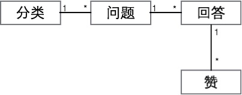

# 问答设计文档

## 手机端h5设计

1. 分类
    * 问题的分类，最多六个分类，分类名称最多4个字，只有一级分类。
2. 问题
    * 用户可以通过手机端h5进行提问，直接输入需要提问的问题，仅限100个字，可以手动选择分类。
3. 回答
    * 用户可以对相应问题直接进行回答，并可以对回答进行点赞。
4. 搜索
    * 用户可以根据关键字搜索相应问题。
    
## 管理后台设计

1. 分类
    * 管理员可以在后台创建分类，最多六个分类，分类名称最多4个字。也可以对分类进行查看、修改和删除
2. 问题
    * 管理员可以在后台创建问题（可以附带一个回答），并可以批量导入问题。也可以查看、导出、搜索、迁移、修改和删除问题
3. 回答
    * 管理员可以在后台查看和删除回答。
    
## 设计图

